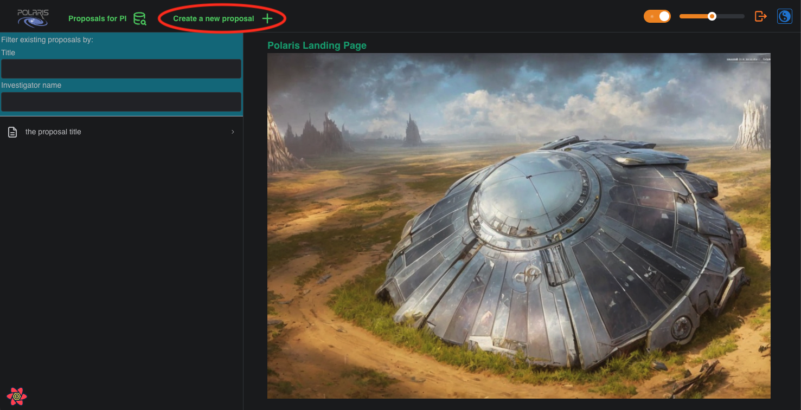
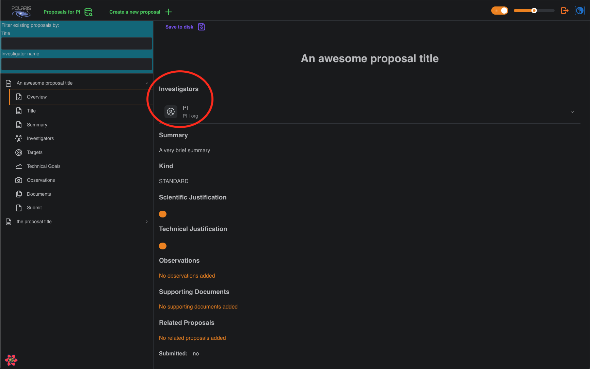

# Creating a new proposal

##  Step 1: Click the "Create a new proposal" button

## Step 2: Fill in the proposal details form and click "Create"

 

The basic details of an "Observing Proposal" are the title for your proposal, a brief Summary of 
your proposal, and the "Kind" of your proposal either "STANDARD", "SURVEY", or "T.O.O." 
(target-of-opportunity). These fields can be modified after you create the proposal.

## The proposal 'Overview'

Now that you have a created a new proposal you can see its 'Overview' by clicking the dropdown 
menu for the relevant proposal in the navigation pane on the left, and clicking on the 'Overview' 
tab.

In the screenshot example we have given our proposal the title "An awesome proposal title", filled 
in the summary with a very brief summary (literally), and assigned it a "Kind" of "STANDARD". Notice 
that, as the creator of the new proposal, you will have been automatically assigned the 'PI', or 
Principal Investigator, role for the proposal (in the example we used for the screenshot, the 
username is also "PI"; nobody said we had to be inventive).