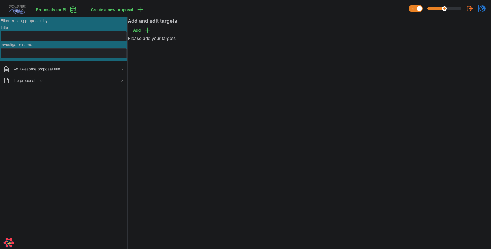
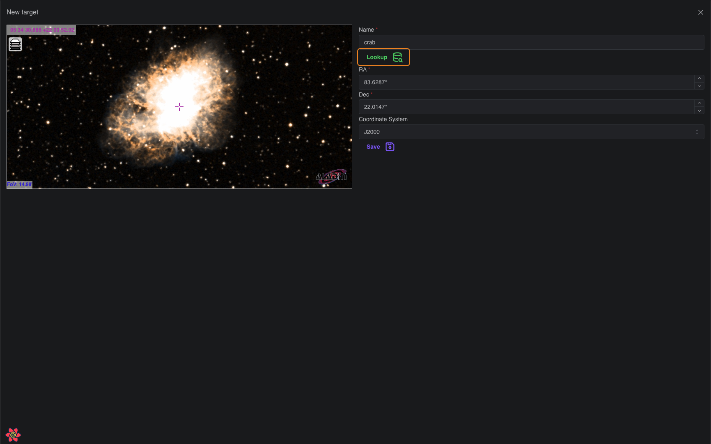
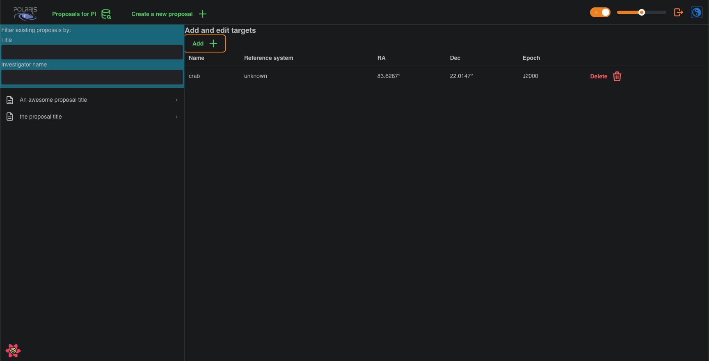

# Add a Target

A fresh proposal will have no **Targets** added, and you will be presented with the following page:

To add a **Target** click the _Add +_ button, which will bring up the _New Target_ form.

In the screenshot you will see we have added the [Aladin Lite Sky Atlas](https://aladin.cds.unistra.fr/),
and we have found the _Crab Nebula_ using the **Lookup** function. This fills in the corresponding 
positional and coordinate system data for the named target, and displays the target in the Sky Atlas. 
Notice that the backend uses [Simbad](https://simbad.cds.unistra.fr/simbad/) to search for the named target, such that the name must 
exist in their databases to be successful; an appropriate error notification is displayed if the 
named target cannot be found. 

You may also simply click anywhere on the Sky Atlas and the corresponding positional details will be 
updated in the RA and DEC fields (notice that these are currently displayed as degrees only, we have 
development plans to add _HH:MM:SS_ format and to allow you to select between the units with which you 
are most comfortable). 

You can also manually fill in the fields, the Sky Atlas will automatically change the view to those 
coordinates. Notice that in this alpha version of Polaris, you can have any coordinate system you like, 
so long as it's _J2000_. 

You may also change the name of the target after you have looked it up and before you save it as a 
**Target**. To save, click the _Save_ button. This will return you to the _Targets_ tab of your proposal 
now displaying the **Target** you just saved, and any other targets you may have added.

Please notice that the _Reference System_ should read _ICRS_ but due to some bug that has yet to be 
squished it reads _unknown_; did I mention this was the alpha version?

You may _Delete_ this target if you so wish, just remember that you need at least one target in order
to build an **Observation** for your proposal.

## Next Step

If you haven't already added a **Technical Goal** then please follow the guide [here](../adding-technical-goals).
If you have now added at least one **Target** and one **Technical Goal** to your proposal then please 
follow the link to [**Building Observations**](../build-observation).