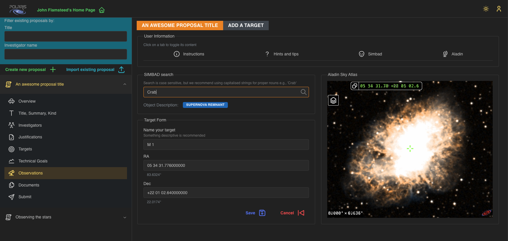

# Add a Target

A fresh proposal will have no **Targets** added, and you will be presented with the following page:

To add a **Target** click the _Add +_ button, which will bring up the _New Target_ form.

In the screenshot you will see we have added the [Aladin Lite Sky Atlas](https://aladin.cds.unistra.fr/),
and we have found the _Crab Nebula_ using the **Search** function. This fills in the corresponding 
positional and coordinate system data for the named target, and displays the target in the Sky Atlas.
Notice that the backend uses [Simbad](https://simbad.cds.unistra.fr/simbad/) to search for the named target, such that the name must 
exist in their databases to be successful; an appropriate error notification is displayed if the 
named target cannot be found. The name displayed after selecting a search item is the _main-id_
name found in the Simbad database. In the screenshot the _main-id_ for the Crab Nebula is "M 1".

You may also double-click anywhere on the displayed Sky Atlas. This will centre the Atlas under the
position you just double-clicked and fill out the form with a "random" target name and the corresponding 
positional details will be updated in the RA and DEC fields. These will be displayed as sexagesimal with
the equivalent degree value displayed under the field box. 

You can also manually fill in the fields, the Sky Atlas will automatically change the view to those 
coordinates. Notice that in this beta version of Polaris, you can have any coordinate system you like, 
so long as it's _J2000_ with an ICRS reference system.

You can change the name of the target after you have looked it up and before you save it as a 
**Target**. To save, click the _Save_ button. This will return you to the _Targets_ tab of your proposal 
now displaying the **Target** you just saved, and any other targets you may have added. Clicking _Cancel_
will take you back to the targets list page without saving.

You may _Delete_ this target if you so wish, just remember that you need at least one target in order
to build an **Observation** for your proposal. For information, you will not be able to _Delete_ targets 
that currently belong to an **Observation** - the corresponding observation must be deleted first.

## Next Step

If you haven't already added a **Technical Goal** then please follow the guide [here](adding-technical-goals.md).
If you have now added at least one **Target** and one **Technical Goal** to your proposal then please 
follow the link to [**Building Observations**](build-observation.md).