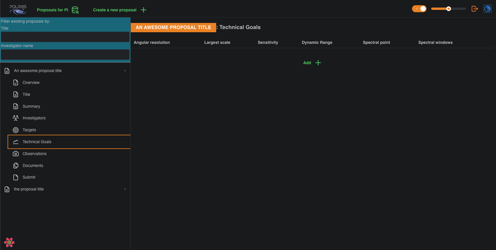
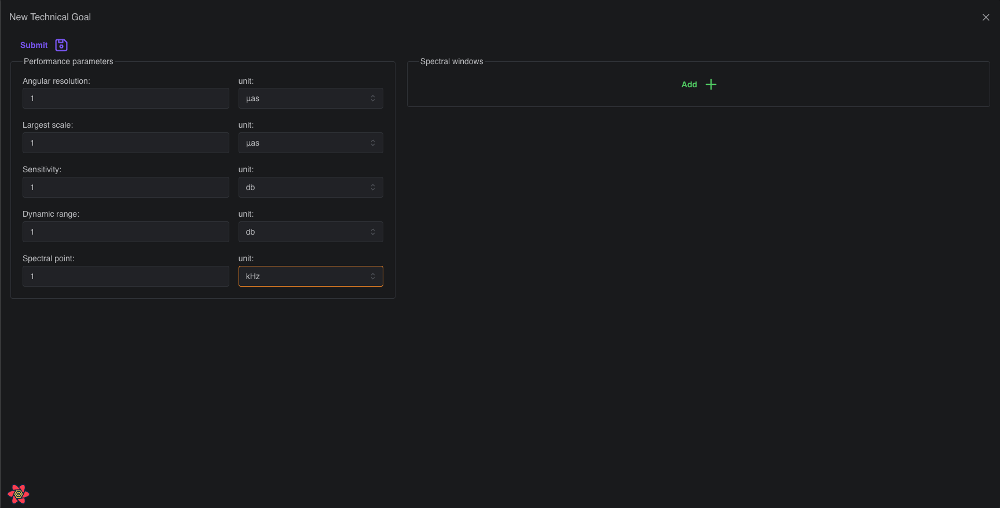
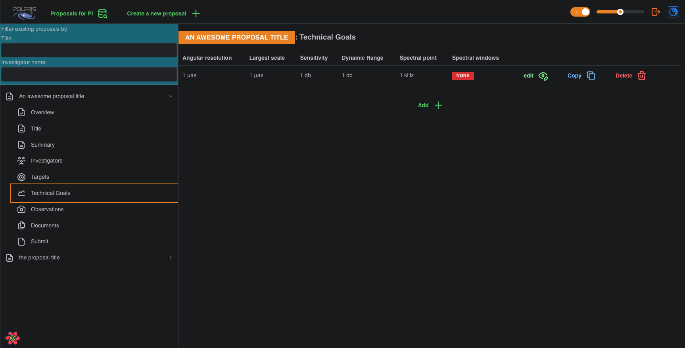

# Add a Technical Goal

A fresh proposal will have no **Technical Goals** and you will be presented with the following page:

To add a **Technical Goal** click the _Add +_ button, which will bring up the _New Technical Goal_ form.

In the screenshot you can see we have filled out the _Performance Parameters_ with some values and their 
corresponding units; the values in the screenshot are contrived for this guide. The units are selected via a 
drop-down menu. These values are what you would like the observation to achieve, and are not necessarily strict 
requirements. Further explanation of each field can be found [here](???) (to-do). The _Performance Parameters_ 
are the minimum amount of information required to _Save_ (screenshot reads _Submit_ because alpha version) a 
**Technical Goal**. For now, we ignore the _Spectral Window_ aspect of a **Technical Goal**, to be revisited later.

After clicking _Save_ you will be brought back to the technical goals summary page, which should now display your
newly added **Technical Goal**. 

Unlike **Targets**, you can also _Edit_ and _Copy_ **Technical Goals** as well as _Delete_ them. This allows you 
to change the attributes of an existing **Technical Goal**, or quickly add other **Technical Goals** that may have 
similar _Performance Parameters_ and/or _Spectral Windows_ without having to re-input all the data. 

## Next Step

If you haven't already added a **Target** then please follow the guide [here](../adding-targets).
If you have now added at least one **Target** and one **Technical Goal** to your proposal then please follow the
link to [**Building Observations**](../build-observation).