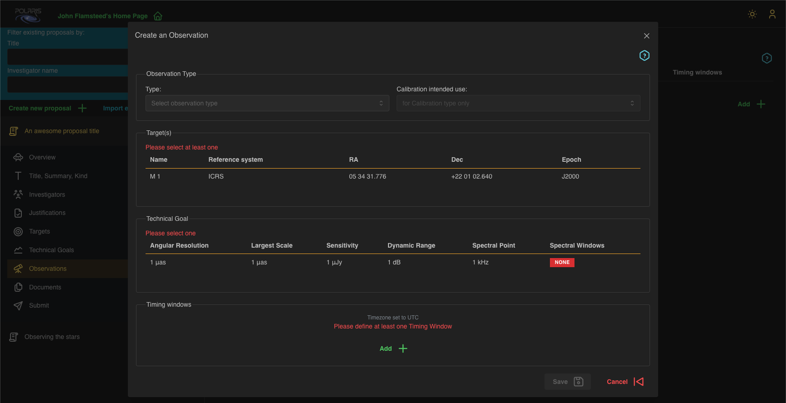
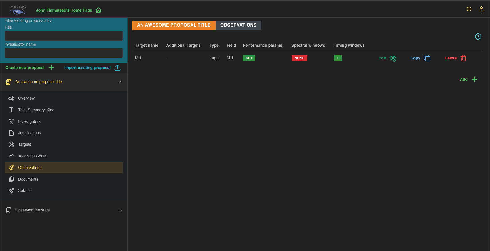

# Build an Observation

After adding at least one **Target** and at least one **Technical Goal** you will see the following summary page 
for **Observations**, which will be empty.

To build an **Observation** click the _Add +_ button, which will bring up the new observation form.

In this screenshot we have yet to fill in the data. You must select the _Type_ of **Observation** either _Target_
or _Calibration_. If selecting _Calibration_ you must also select the _Intended Use_ of the calibration. There 
are several options here including but not limit to _Pointing_, _Bandpass_, _Focus_, and _Delay_ amongst others.
The messages in red describe the necessary fields that are required to create an **Observation** after selecting
its type, and intended use where appropriate.

Each **Observation** must have at least one **Target** and multiple selections are allowed. **Observations** can
only have one **Technical Goal** selected, and you must provide at least one **Timing Window**. 

A **Timing Window** is a timing constraint on the **Observation**, and consists of _start_ and _end_ times that 
can be specified up to the minutes unit, an _avoid_ toggle switch that changes the meaning of the window, to be
explained presently, and an optional note to provide additional information if required. Typically, a 
**Timing Window** will specify the range of times when the **Observation** should be performed i.e., the _avoid_ 
toggle is unset. However, with the _avoid_ toggle set the window then specifies the range of times when the 
**Observation** should **_not_** be performed. (Notice that
the **Timing Window** must relate to the **Proposal Cycle** _session_ interval to which you will be submitting
the proposal - this validation check is done during the submission process.)

You can add as many **Timing Windows** to an **Observation** as required by your needs. Please note that the 
_start_ time must be at an earlier time than the _end_ time, but that different **Timing Windows** may overlap. 
In this case, it is recommended to write optional notes to provide context for anyone reviewing your proposal. 
Notice that we assume all times are entered as UTC. 

With all that information entered, click _Save_ to save the **Observation** to your **Proposal**. This will 
bring you back to the _Observations_ summary page, that will now contain your newly built **Observation**.

As with **Technical Goals** you may _Edit_ and _Copy_ **Observations** to avoid having to repeat data entry for
**Observations** that have similar attributes. For example, using the same **Target** but for different types,
_Target_ or _Calibration_, of **Observation** with perhaps the same **Technical Goal** and/or timing constraints.

With an **Observation** now built both the **Target** and the **Technical Goal** to which is refers have their 
_Delete_ button disabled. This prevents you from deleting either of these things while they are actively referred
to by an **Observation**. In order to re-enable the _Delete_ button on **Targets** and **Technical Goals** you 
must first delete all **Observations** that refer to them.

## Next Steps

If you have yet to fill out the Justifications for your proposal please follow the guide at
[**Justification**](../Justifications/index.md)

To see how to submit your proposal for review please follow the guide at 
[**Submitting Proposals**](../Submitting%20Proposals/index.md)