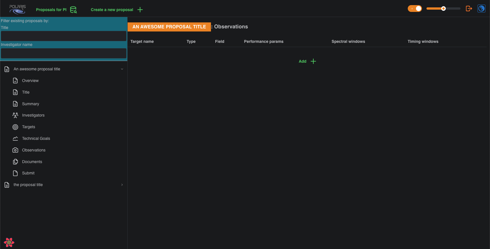

# Build an Observation

After adding at least one **Target** and at least one **Technical Goal** you will see the following summary page 
for **Observations**, which will be empty.

To build an **Observation** click the _Add +_ button, which will bring up the new observation form.

In this screenshot we have already selected our **Target**, the "crab", and our **Technical Goal**, and have
selected the _Observation Type_ as _Calibration_ and the _Calibration intended use_ as _Pointing_. Notice that
the _Observation Type_ is a choice between _Target_ and _Calibration_, and if you select _Target_ there is no
"intended use" field; the **Target** is the intention of the **Observation**. For a _Calibration_ **Observation**
there are several "intended use" options to pick from; see the [documentation](???) (to-do) for details. 

Selecting the **Target**, **Technical Goal**, and _Observation Type_ is the minimum amount of information to _Save_ 
an **Observation** to the database. However, for the **Proposal** to pass the server side validation before 
submission, all **Observations** in the **Proposal** must have at least one **Timing Window**. 

A **Timing Window** is a timing constraint on the **Observation**, and consists of _start_ and _end_ times that 
can be specified up to the minutes unit, an _avoid_ toggle switch that changes the meaning of the window, to be
explained presently, and an optional note to provide additional information if required. Typically, a 
**Timing Window** will specify the range of times when the **Observation** should be performed i.e., the _avoid_ 
toggle is unset. However, with the _avoid_ toggle set the window then specifies the range of times when the 
**Observation** should **_not_** be performed. 

You can add as many **Timing Windows** to an **Observation** as required by your needs. Please note that the 
_start_ time must be at an earlier time than the _end_ time, but that different **Timing Windows** may overlap. 
In this case, it is recommended to write optional notes to provide context for anyone reviewing your proposal. 
Notice that we assume all times are entered as UTC. 

With all that information entered, click _Save_ to save the **Observation** to your **Proposal**. This will 
bring you back to the _Observations_ summary page, that will now contain your newly built **Observation**.

As with **Technical Goals** you may _Edit_ and _Copy_ **Observations** to avoid having to repeat data entry for
**Observations** that have similar attributes. For example, using the same **Target** but for different types,
_Target_ or _Calibration_, of **Observation** with perhaps the same **Technical Goal** and/or timing constraints.

With an **Observation** now built both the **Target** and the **Technical Goal** to which is refers have their 
_Delete_ button disabled. This prevents you from deleting either of these things while they are actively pointed 
to by an **Observation**. In order to re-enable the _Delete_ button on **Targets** and **Technical Goals** you 
must first delete all **Observations** that refer to them. 

In this alpha version of Polaris, once you have an **Observation** with at least one **Timing Window** in your 
**Proposal** it will pass server side validation checks, and you may submit it for review. In subsequent versions,
you will also have to provide both **Scientific** and **Technical Justifications** to pass validation checks, and
it is likely more things will be added to the validation check in the future.

To see how to submit your proposal for review please follow the guide at 
[**Submitting Proposals**](../../submitting-proposals)