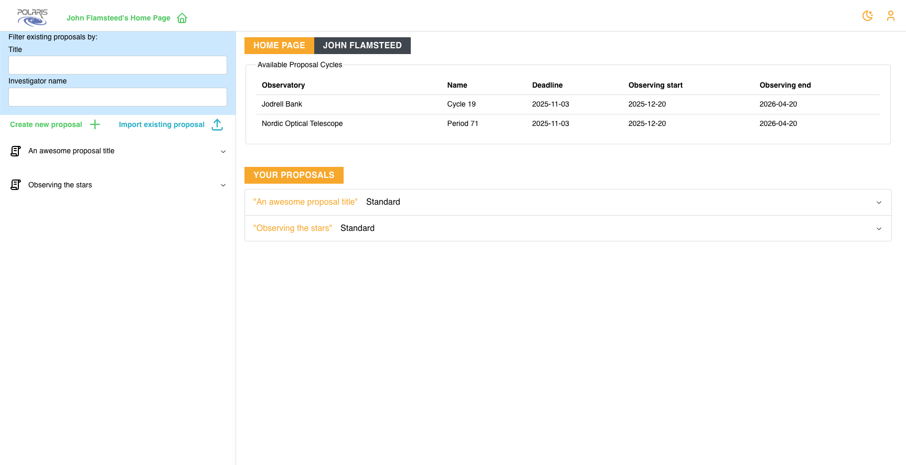
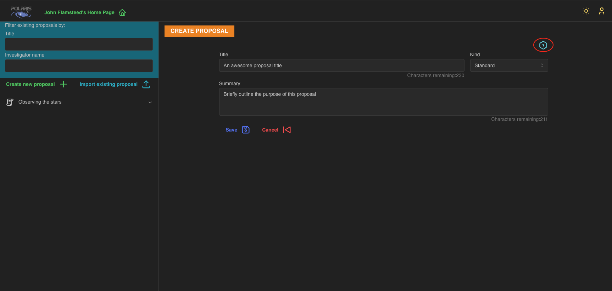
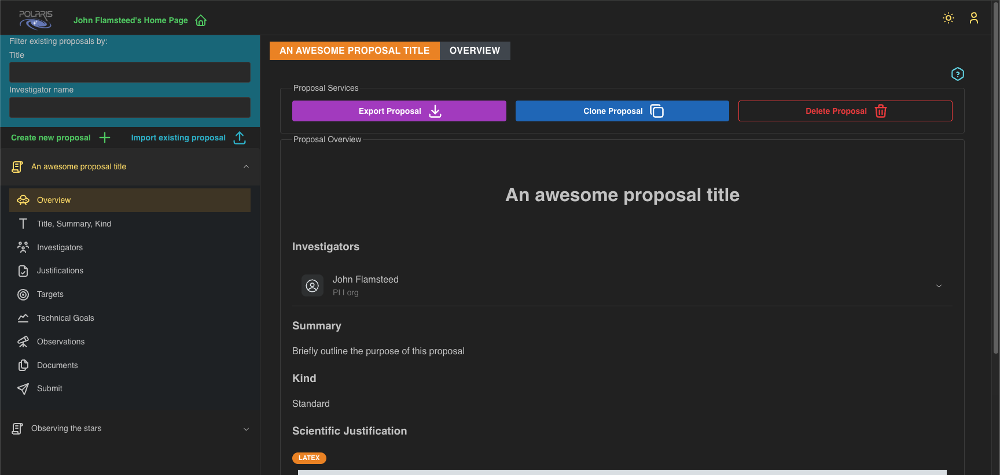
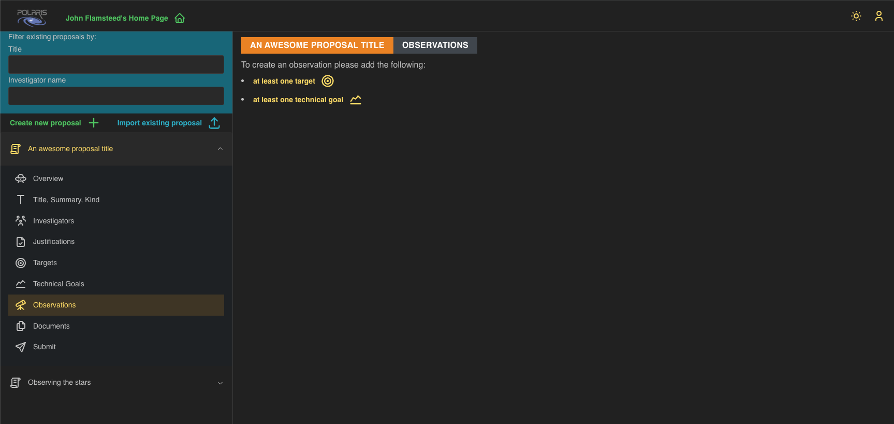

## Notice about the Polaris version

This documentation is for the _beta_ version of Polaris.

Last updated **2025-10-21**

## First, Login

If you haven't registered with and logged-in to Polaris please do so [now](https://kilburn.jb.man.ac.uk/pst/gui/tool/).
In the following guide we are logged in as "John Flamsteed" as an obvious fake user.

##  **Create a new proposal**

To create a new **Proposal** click on the _Create new proposal +_ button on your home page. This is highlighted
by the red circle in the screenshot below.

This will bring up the new **Proposal** details form. Please notice that this screenshot is in dark-mode.
You may select light-mode by clicking the toggle button in the very top right of the window, left of the
"user management" button. When in dark-mode the button will be a "sun", meaning go-to light-mode, and when
in light-mode it will be a "crescent-moon", meaning got-to dark-mode. The following screenshot shows what
light-mode looks like.

Switch to which ever mode you want. The author of this guide prefers dark-mode so that is the mode the rest
of the screenshots will show. 

## Fill in the proposal details form and click **Create**

The basic details of an **Observing Proposal** are the title, a brief Summary, and the "kind" of your proposal 
either _STANDARD_, _SURVEY_, or _T.O.O._ (target-of-opportunity). These attributes can be changed after you create 
the proposal. Please note that we have help buttons located on the top right of most pages - a blue question mark in 
a hexagonal border (circled in red in the screenshot) that will drop down some basic textual help for that page. 
If a page does not have this button the help will be located in a tab on the page somewhere.

## The Proposal Overview

Now that you have a created a new proposal you can see its **Overview** by clicking the dropdown 
menu for the relevant proposal in the navigation pane on the left, and clicking on the _Overview_ 
tab.

In the screenshot example we have given our proposal the title _An awesome proposal title_, filled 
in the summary with a very brief summary, and assigned it a **Kind** of _STANDARD_. Notice 
that, as the creator of the new proposal, you will have been automatically assigned the **PI**, or 
Principal Investigator role for the proposal.

## Proposal Services

You will notice three buttons at the top of the overview page, namely _Export Proposal_, _Clone Proposal_, and
_Delete Proposal_. 

_Export Proposal_ provides a downloaded zip file containing this proposal as JSON, any supporting 
documents you may have uploaded, and a screenshot of this overview. The astute among you will have realised this
is the file you upload when you click on the button _Import existing proposal_. The intention of this is to allow
you to transfer proposals between different instanced of the Polaris application. 

_Clone Proposal_ creates a deep copy of the current proposal as a new proposal i.e., everything is copied - 
targets, technical goals, observations, justifications, supporting documents, ...

If you've decided that this proposal is no longer worth pursuing then clicking on _Delete Proposal_ will remove 
it permanently from the system. Notice that if the proposal has been submitted to a **Proposal Cycle** that submitted 
proposal is _NOT_ removed from the cycle. We explain about **Submitted Proposals** elsewhere, but for now see them 
as a "snapshot" of the proposal at the point of submission. We would recommend that you don't delete proposals that
are actively submitted to a cycle.

## Next Steps: adding Targets and Technical Goals

If you now try to go to the _Observations_ tab you will be presented with the following page:

In the Polaris app you must first add at least one observational **Target** and at least one **Technical
Goal** before you can generate an **Observation** for your proposal. Notice that the yellow text in the
screenshot is a link to take you to the corresponding page in the App. 

For the next steps in this guide, please go to either [**Adding Targets**](adding-targets.md) or 
[**Adding Technical Goals**](adding-technical-goals.md), the order here does not matter. 
The [**Building an Observation**](build-observation.md) guide assumes you have added at least one target and at least 
one technical goal to your proposal.
