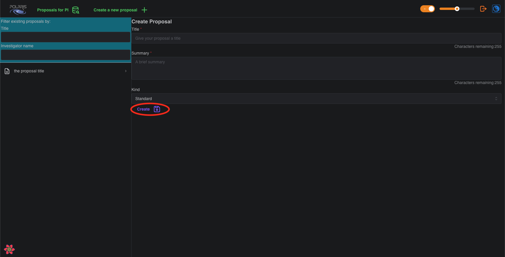
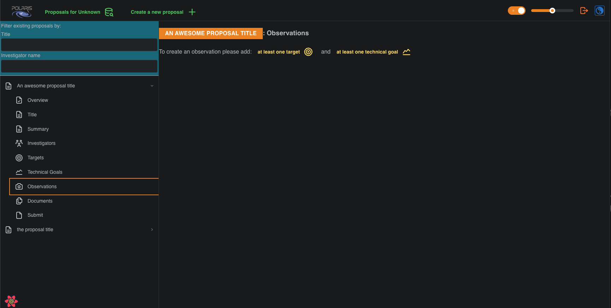

## First, Login

If you haven't registered with and logged-in to Polaris please do so [now](tbc).

##  Click the **Create a new proposal** button

This will bring up the new **Proposal** details form. 

## Fill in the proposal details form and click **Create**

The basic details of an **Observing Proposal** are the title, a brief summary, and the **Kind** of your proposal 
either _STANDARD_, _SURVEY_, or _T.O.O._ (target-of-opportunity). These attributes can be changed after you create 
the proposal.

## The Proposal Overview

Now that you have a created a new proposal you can see its **Overview** by clicking the dropdown 
menu for the relevant proposal in the navigation pane on the left, and clicking on the _Overview_ 
tab.

In the screenshot example we have given our proposal the title _An awesome proposal title_, filled 
in the summary with a very brief summary (literally), and assigned it a **Kind** of _STANDARD_. Notice 
that, as the creator of the new proposal, you will have been automatically assigned the **PI**, or 
Principal Investigator, role for the proposal (in the example we used for the screenshots, the 
username is also _PI_; nobody said we had to be inventive).

## Next Steps: adding Targets and Technical Goals

If you now try to go to the _Observations_ tab you will be presented with the following page:

In the Polaris app you must first add at least one observational **Target** and at least one **Technical
Goal** before you can generate an **Observation** for your proposal. Notice that the yellow text in the
screenshot is a link to take you to the corresponding page in the App. 

For the next steps in this guide, please follow either the **Adding Targets** link or the **Adding Technical Goals** 
link, the order here does not matter. The **Building Observations** page assumes you have added at least one target 
and at least one technical goal to your proposal.
