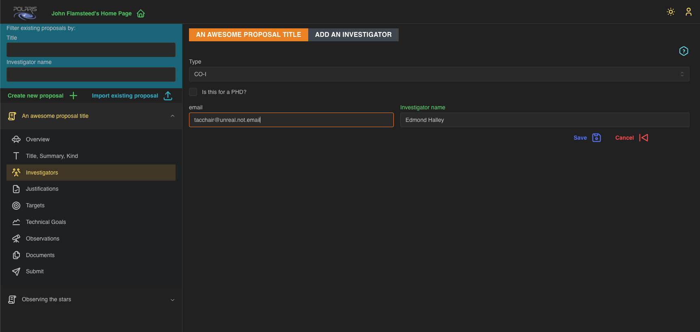

## Adding Investigators
The **Investigators** section of your proposal will list all the people currently associated with the 
proposal either as Principal Investigators (PIs) or as Co-Investigators (CoIs). 

As a PI you may add other users of _Polaris_ as **Investigators** to the proposal. To do this click the
_Add +_ button which will bring up the following form:

You may search for other users of _Polaris_ using their email address, but you must fully specify the
address to find the specific person (in other words, you must know the other person's email address to
find them - GDPR: the gift that keeps on giving). In the screenshot above you will see that we have found
the (fake) user "Edmond Halley" as we knew the (fake) email address assigned to that user. Click _Save_
to add that person as an **Investigator** to the proposal. Notice that you can specify the _Type_ of 
**Investigator**, either a PI or a CO-I, and if the proposal is for a PhD project.

In future versions of _Polaris_ this will also email that user about their addition to the proposal.

## Swapping Roles

In the screenshot below we have added "Edmond Halley" as a CoI to the proposal.

You will notice alongside the _Delete_ button, which will remove the person as an **Investigator** from
the proposal, is a _Swap Role_ button which allows you to switch a person's "type" of **Investigator**;
PI -> CoI or CoI -> PI. There is a restriction on this: a proposal _must_ have at least one PI. If as
the only PI you want to swap roles to a CoI, you must first switch a CoI to a PI. We would recommend
that you inform the CoI that you wish to switch to being a PI as a courtesy, but there are no 
restrictions in Polaris to enforce this. 

Currently, you cannot edit an existing **Investigator**. If, for example, you forget to check the
"Is this for a PhD?" checkbox when adding a person as an **Investigator**, you must first _Delete_
them from the proposal, then re-add them (remembering to check the checkbox).

If you haven't already, please now follow the guide about [**Submitting your proposal**](../Submitting%20Proposals/index.md)