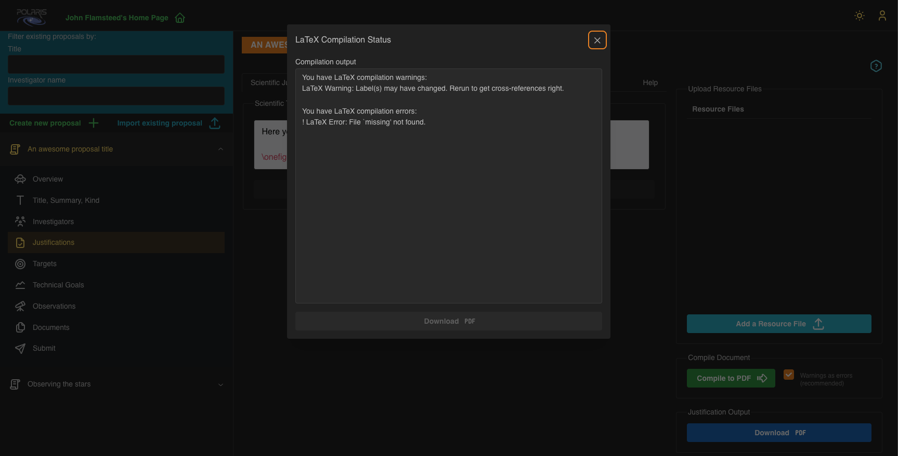

Last updated **2025-10-24** Polaris _beta_ version.

## Filling out Justifications

In Polaris there are two **Justification** "flavours": **Scientific** and **Technical**.

Both **Justifications** are to be provided as LaTex text strings. That is, text decorated with
the usual LaTex commands for figures, tables, and citations (or whatever else you want to insert into your document).

In the current version of Polaris you must manually save (urgh!) your **Justification** texts. We recommend creating
and editing the texts elsewhere then copy-paste them into Polaris. In future versions of Polaris we will make the
Justifications a "save as you type" service. 

These texts will be inserted into the following "main.tex" file under the relevant section headings:

```
%%%%%%%%%%%%%%%%%%%%%%%%%%%%%%%%%%%%%%%%%%%%%%%
% 
\documentclass[11pt,a4paper,twoside]{article}
%
\usepackage[textwidth=17.5cm,textheight=25cm,headheight=14pt]{geometry}
\usepackage{graphicx}
\usepackage{subfig}
\usepackage{wrapfig}
\usepackage{fancyhdr}
\usepackage[square,numbers,super]{natbib}

% latex working directory is created as a child of where the images are stored %
\graphicspath{{../}}

% condense the line separation between bibitems
\setlength{\bibsep}{1pt plus 0.3ex}

...

%%%%%%%%%%%%%%%%%%%%%%%%%%%%%%%%%%%%%%%%%%%%%%%

\begin{document}
% Header file created on compilation
    \input{justificationsHeader}

% Justification files created on compilation
    \section*{Scientific Justification}
    \input{scientificJustification}

    \section*{Technical Justification}
    \input{technicalJustification}

    \bibliographystyle{polaris}
% Users are expected to provide a single bibliography file.
% It will be copied and renamed to "refs.bib" in the working directory
    {
        \footnotesize
        \bibliography{refs}
    }

\end{document}
%%%%%%%%%%%%%%%%%%%%%%%%%%%%%%%%%%%%%%%%%%%%%%%
```
The ellipsis (...) in the file replaces a lengthy section where we define custom "insert figure" functions. These
functions are described in detail in the _Help_ tab found on the **Justifications** page in Polaris. Also see the
[**Custom Insert Figure Functions**](#custom-insert-figure-functions) section below.

We are using our own bibliography style template that (generally) gives only the sufficient details of a reference
to find the associated article. We've done this in an effort to reduce "bloat" in the _References_ section of the
compiled document.

The following screenshot shows the Justifications page in Polaris. Please notice that the two **Justification**
text areas are found in separate tabs labelled _Scientific Justification_ and _Technical Justification_, along with 
the _Help_ tab.


## Scientific Justification

The scientific justification should include all the physics reasons why you want to perform the observation(s) 
specified in this proposal. This will likely be the same regardless of the **Proposal Cycle** to which you will be 
submitting the proposal. 

The scientific justification is limited to a **maximum of 15000 characters**.

## Technical Justification

The technical justification should outline the reasons for your choice of observatory, and their capabilities to 
achieve the technical goals you've set. Choice of observatory is made when submitting the proposal, different 
**Proposal Cycles** are associated with different observatories. If you wish 
to submit this proposal to multiple observatories, you will likely need to edit the technical justification to 
tailor it to each observatory.

The technical justification is limited to a **maximum of 5000 characters**.

## Resource Files

The _Resource Files_ area is where you upload your image files to be inserted as figures into your Justifications, 
and a single bibliography file (*.bib) that you use for citations - to reference a citation you use the normal LaTex
syntax i.e., ~\\cite{referenceLabel}. 

Please note that image formats are restricted to '.jpg', '.png', '.eps', and '.pdf', and
be aware that uploading an image file with the same filename as an existing file
will overwrite that file, and there will be no warning. You cannot have multiple bibliography files.

Justification resource files are considered to be **Supporting Documents** and as such can also be viewed and
downloaded in the **Documents** section of Polaris. The documents belong to a given proposal and all _Investigators_
associated with the proposal may view and download the files any other investigator has uploaded.

## Custom Insert Figure Functions

As we have limited the length of **Justifications** you may not want to waste
precious characters on LaTex syntax, especially when it comes to inserting figures into your document.
For that reason we have provided you with some custom functions to try to help reduce the
number of characters required to insert figures. These are namely:

* **\\onefigure\[width\]{filename}{caption}**
* **\\twofigures\[width\]{filename1}{filename2}{caption}**
* **\\threefigures\[width\]{filename1}{filename2}{filename3}{caption}**
* **\\fourfigures\[width\]{filename1}{filename2}{filename3}{filename4}{caption}**
* **\\textwrapfigure\[width\]{filename}{caption}{position}**

The **width** parameter is optional but if provided should a decimal number between 0
and 1, defining the width of the figure in terms of the text-width. It defaults to
0.5 for the single figure cases, and is an even division of the total text-width for
the multiple figure cases. If supplied, the width parameter for the multiple figure
cases applies to each of the images in the figure, rather than the whole figure itself.
The astute among you will have deduced then that the product of the width
value with the number of figures must not exceed one, else the figures will overflow
the text.

The **filename** parameter(s) should match the name of the image file(s) that you wish to
insert. You may exclude the dot extension part of the filename, just remember that the filename
string parameter is used in the figure label.

The **caption** parameter is the description of the figure you are inserting. Please note
_captions_ count towards the characters used so try to be concise. 

To reference a figure in your text, use the following syntax: \\ref{fig:filename}.
Again remember that the 'filename' is literally that which you supplied in the insert figure command. For the 
multiple figure cases, the 'filename' should be the name of the first filename parameter. There is one, 
edge-case issue with this labelling strategy. If you have a single figure that uses an image file repeated
as the first image in a multiple figure command, you'll get a naming conflict. The most straightforward 
way around this issue would be to exclude the dot extension for one of the filenames. If you're including
the same image in more than two figures (I mean, _WHY_!?) then you could upload 
the image with different filenames such that the figure labels will be different.

Notice that the two figure and three figure functions will place the images in a
single row, whereas the four figure function will place the images in a two-by-two
arrangement. For the multiple figure functions, each image will be labelled '(a)' through '(d)' where appropriate.

If the multiple figure-caption layout is not to your liking, or you have more than four images to place in a figure,
then you can always create your own multiple figure as a single image file and use the "onefigure" command.

For the 'textwrapfigure' command an additional parameter specifies the position of
the figure you want to text-wrap. Either 'l' or 'L' for the image on the left,
or 'r' or 'R' for the image on the right. The uppercase version allows the image to
float, whereas the lowercase version means exactly here. (Our command uses the
'wrapfigure' environment from the 'wrapfig' package).

Of course, you can entirely ignore these custom insert figure functions and use the standard Latex syntax for
inserting figures (using the 'graphicx' package). 

# Compiling your Justification

To compile your **Justification** document click the _Compile to PDF_ button. We
recommend keeping 'Warnings as errors' checked. After a short delay waiting for the compilation 
to complete on the server, a modal will open displaying the status of the compilation.

If you have compilation errors they will be listed in the _Compilation output_ section of the modal.
Typically, these will be caused by typos in the LaTex commands or missing resource files. To illustrate
in the following screenshot we have tried to compile a document with an insert figure command using
an image file named 'missing' we have yet to upload to the server.



Please notice that if you do have compilation errors you may also have warnings with regard to
references. This is because Latex generally has to make two parses of any source files, first
to work out the document structure, the second to get cross-referenced labels and numbering correct.
As user errors typically occur during the first parse, the second parse is not done hence the warnings
about cross-references. 

If your compilation was successful you will see the following output in the modal.


It will give you a page count and a _Download PDF_ button that when clicked downloads the compiled document.
Another _Download PDF_ button will also appear in the **Justifications** main page. Please be aware that the
button on the Justifications main page, will download the latest _successfully_ compiled document only. That is,
any edits to your Justification texts that do not compile successfully will not appear in the downloadable
document obtained from the button on the main page (this may be obvious to most of you, but we know what some of you are like).

For your information, you will see a "_CYCLE-ID-HERE_" placeholder in the header of the document. This is for the
Time Allocation Committee (of a particular Proposal Cycle) use only, and is replaced with an actual value upon 
submission of the proposal to a cycle.

If you haven't already, please now follow the guide about uploading [**Supporting Documents**](../Supporting%20Documents/index.md).