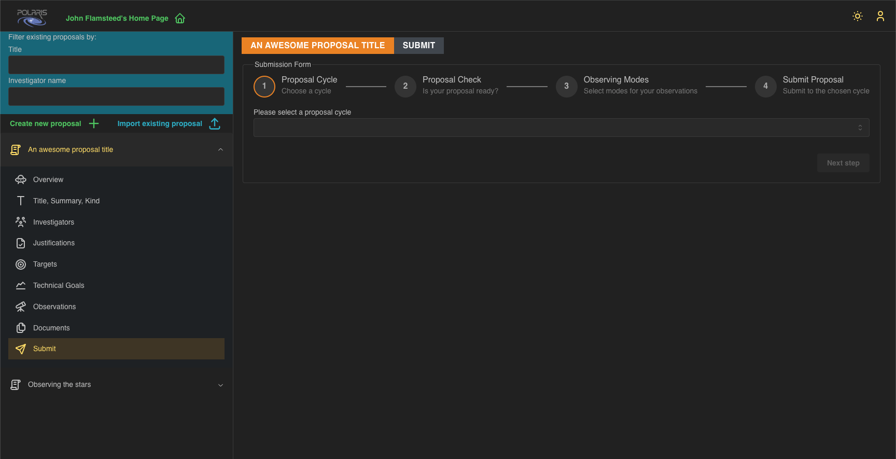
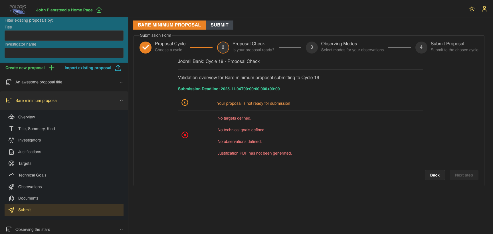
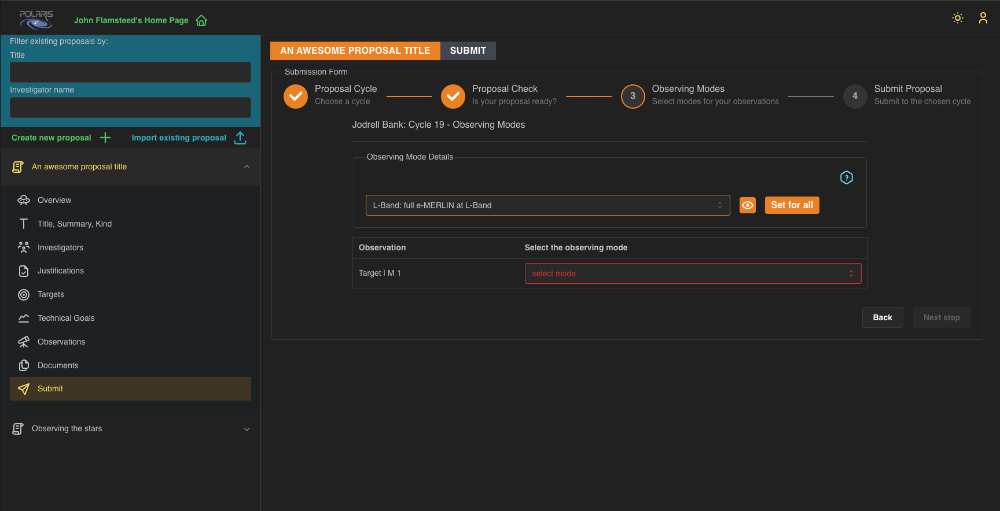
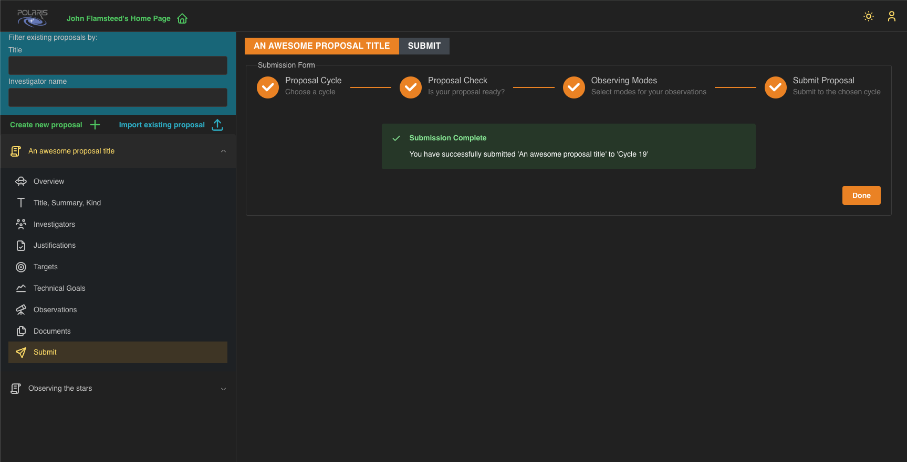

Last updated **2025-10-21** Polaris _beta_ version.

# Submit your Proposal

Once you are happy with the details of your **Proposal**, and it has passed the server side validation checks
you may submit it for review.
The proposal submission process consists of several steps.

## Step 1 - Select the **Proposal Cycle**

Here you select the **Proposal Cycle** from the drop-down menu to which you wish to submit your **Proposal**.
Once selected click _Next step_ to continue to the next step.

## Step 2 - Validation Check

Server side validation checks currently include:

* at least one **Observation** added with at least one **Timing Window**
  * which requires at least one **Target** and at least one **Technical Goal**
* a successfully compiled Justification PDF

As we develop the server side validation checks this list will grow. We expect this list to expand as we put 
Polaris in to beta-testing.

If a **Proposal** doesn't pass the validation checks then you will be presented with the following page for 
_Step 2_ in the submission process, which lists the problems.

Here we have created another proposal but haven't added any **Targets**, **Technical Goals**, or **Observations**. 
Please notice that the messages are links that will take you to the relevant page in Polaris so you can address
the issues. In this case the _Next step_ button is disabled.

A **Proposal** that does pass these validation checks will be shown the following page.

Again click _Next step_ to continue to step 3.

## Step 3 - Select **Observing Modes** for your **Observations**

Here you select the **Observing Modes** you want for your **Observations**. Notice that the selectable data here
depends on your choice of **Proposal Cycle**. For example, having chosen the eMerlin proposal cycle (generally 
named "Cycle N", where N represents the cycle number) you can choose between _L-Band_, _C-Band_, and _K-Band_ 
**Observing Modes**. You may either select a single **Observing Mode** for all the **Observations** in your 
proposal, most conveniently done by selecting the mode in the _Observing Mode Details_ section and clicking
the _Set for all_ button, or select the mode for each observation separately. Once each of your **Observations**
has a mode you may proceed to step 4.

The "eye" button in the _Observing Mode Details_ section will toggle a display of the details of the selected mode. 
For example, the eMerlin modes show details of the receivers and the correlator involved, and will show which 
of the telescopes will ideally be used for the observation.

## Step 4 - Review selections before submitting

This is your last chance to ensure all the details selected are correct for your proposal before you submit it 
to the chosen **Proposal Cycle**. If you do need to change something then you may go _Back_ and make the desired 
changes.

Once you are happy with all the details you can click on the _Submit proposal_ button, and all being well, you
should be presented with the following screen.

You will also be sent a confirmation email outlining that you have just successfully submitted your proposal to
the cycle of choice. This email is sent to all investigators associated with the proposal.

Clicking on _Done_ will take you back to the _Overview_ page for the proposal.

## Withdrawing a Submitted Proposal

The Principal Investigator may withdraw a submitted proposal from a **Proposal Cycle** up to the submission
deadline for that cycle. The _Withdraw_ button is located on the user's homepage, one per cycle to which a proposal 
has been submitted, shown in the screenshot below.

You may submit and withdraw a proposal to a particular cycle _ad nauseam_, but do try to not over do it, for your 
own sake as much as anyone else's. 
